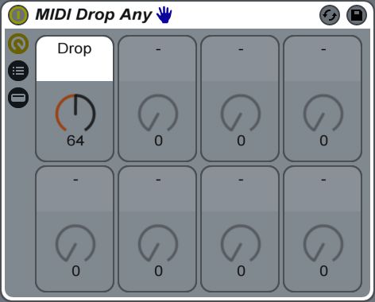
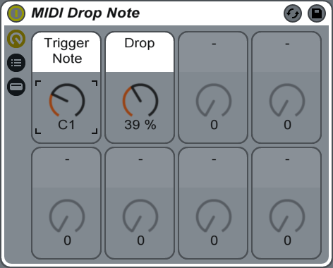
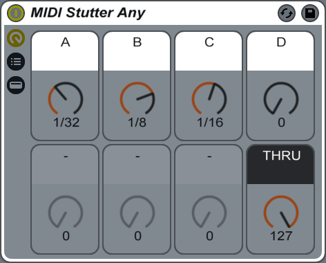
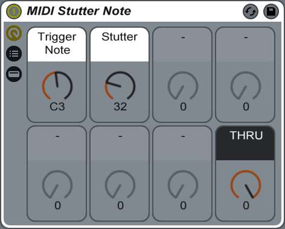
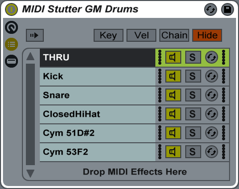

# AbletonLiveMIDINoteProcessors
MIDI note processors for Ableton Live using only lite and standard devices

Ableton Live (lite and standard) has devices that "do one thing well" and "work together" for realtime MIDI note processing. Pitch and velocity modulation/randomisation are possible easily. More complex realtime processes (proability to play/drop or stutter/echo notes, etc) are very useful when working with drum patterns and/or with external hardware.

The device group racks here do exactly that and use only lite/standard edition devices. No Max4Live M4L amxd etc required.

Two ".adg" formats are provided (v7 binary, and v9 gzip xml).
If you fork these, please be sure to maintain compatibile file formats! 😅

## MIDI Drop Any

- Omit notes with precise probability. 
- This rolls a dice for each note to determine if it will play or "drop".
- This useful for "thinning out" busy sequences.
- E.G. Insert this on a drum pattern track to give subtle variation for the whole pattern.
- You may want "MIDI Drop Note" instead.

## MIDI Drop Note

- Omit a specific note trigger and with precise probability.
- This first blocks all but a specific note, then rolls a dice to play or "drop" it.
- This is useful for "thinning out" specific notes in busy sequences.
- E.G. Insert this before a drum/instrument rack to give subtle variation for one note.
- You may want "MIDI Drop Any" instead. 

## MIDI Stutter Any

- Inject echo (stutter) with precise timing. 
- This processes any and all notes which can be intense on busy sequences.
- This is useful to add "ghost" or "flam" or "roll" notes to sequences.
- E.G. Insert this with and after "MIDI Drop Note" to inject rolls and flams for one note.
- E.G. Insert this in a "Drum Rack" slot to give subtle variation for that note slot.
- You may want "MIDI Stutter Note" or "MIDI Stutter GM Drums" instead.

## MIDI Stutter Note

- Injects echo (stutter) for a specific note trigger with precise probability and timing.
- This rolls a dice to stutter a specific trigger note.
- This is useful to add "ghost" or "flam" or "roll" notes to specific trigger notes.
- E.G. Insert this on a drum pattern track to inject variation for one specific sound.
- You may want "MIDI Stutter Any" or "MIDI Stutter GM Drums" instead.
- Add many of these in a row for as many trigger notes as you require.
- Particularly useful when "Drum Rack" slots are not in use (e.g. w/hardware sampler).

## MIDI Stutter GM Drums

- Injects echo (stutter) for some GM drum note #s with adjustable probability and timing.
- This is a pre-built setup with "MIDI Drop Note" and several "MIDI Stutter Note"s.
- E.G. Insert this on a drum pattern track to give subtle variation for the whole pattern.
- Please edit the trigger note #s and probabilities to suit your pattern.